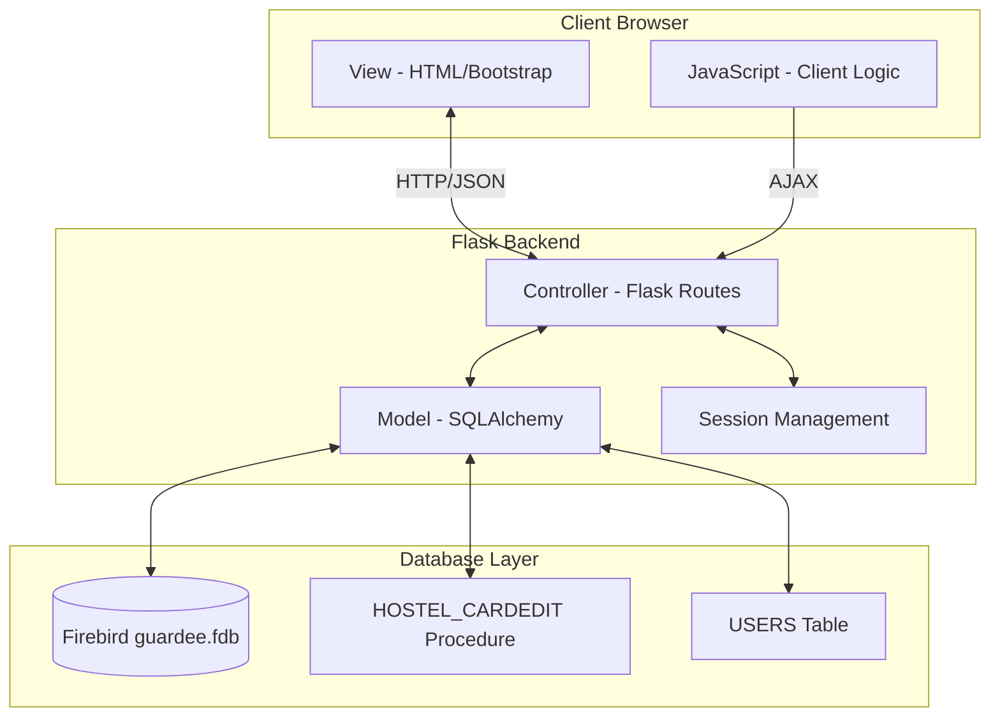

# Документ дизайна: Веб-интерфейс управления картами

## Overview

Веб-приложение для управления картами представляет собой полнофункциональную систему CRUD (Create, Read, Update, Delete) для работы с электронными пропусками. Приложение построено на архитектуре клиент-сервер с четким разделением ответственности между frontend и backend компонентами.

**Технологический стек:**
- Backend: Flask (веб-фреймворк), SQLAlchemy (ORM), fdb (драйвер Firebird)
- Frontend: HTML5, CSS3, JavaScript (ES6+), Bootstrap 5
- База данных: Firebird (guardee.fdb)
- Аутентификация: Flask-Session

**Ключевые особенности дизайна:**
- Все операции с данными выполняются через хранимую процедуру HOSTEL_CARDEDIT
- Двухуровневая валидация (клиент + сервер)
- Аутентификация через таблицу USERS базы данных
- Выбор файла базы данных через веб-интерфейс
- Отзывчивый дизайн с Bootstrap 5

## Architecture

### Архитектурный паттерн: MVC (Model-View-Controller)



### Слои приложения

**1. Presentation Layer (Frontend)**
- Отвечает за отображение данных и взаимодействие с пользователем
- Использует Bootstrap 5 для отзывчивого дизайна
- Выполняет клиентскую валидацию через JavaScript
- Отправляет AJAX-запросы к backend API

**2. Application Layer (Backend)**
- Flask routes обрабатывают HTTP-запросы
- Выполняет серверную валидацию
- Управляет сессиями пользователей
- Координирует взаимодействие между frontend и database layer

**3. Data Access Layer**
- SQLAlchemy ORM для абстракции работы с БД
- Вызов хранимой процедуры HOSTEL_CARDEDIT
- Управление транзакциями и соединениями

**4. Database Layer**
- Firebird база данных guardee.fdb
- Хранимая процедура HOSTEL_CARDEDIT для всех операций CRUD
- Таблица USERS для аутентификации

## Components and Interfaces

### Backend Components

#### 1. Flask Application (app.py)
**Ответственность:** Инициализация приложения, конфигурация, регистрация blueprints

```python
# Основная конфигурация
app = Flask(__name__)
app.config['SECRET_KEY'] = os.environ.get('SECRET_KEY')
app.config['SESSION_TYPE'] = 'filesystem'
```

#### 2. Database Manager (db_manager.py)
**Ответственность:** Управление подключениями к Firebird, вызов процедур

**Интерфейс:**
```python
class DatabaseManager:
    def __init__(self, db_path: str, host: str = 'localhost', port: int = 3050):
        """Инициализация менеджера БД"""
        
    def connect(self, username: str, password: str) -> bool:
        """Установка соединения с БД"""
        
    def disconnect(self):
        """Закрытие соединения"""
        
    def call_cardedit_procedure(self, action: int, room: int, card_number: int, 
                                 valid_from: date, valid_until: date) -> dict:
        """
        Вызов HOSTEL_CARDEDIT
        action: 0=получить, 1=добавить/редактировать, 2=удалить, 3=заблокировать, 4=активировать
        Возвращает: {'people_id': int, 'card_id': int, 'result': int}
        """
        
    def call_upd_dumps(self, card_number: int):
        """Вызов UPD_DUMPS после операций с картой"""
        
    def get_all_cards(self) -> list:
        """Получение списка всех карт (записи с фамилией 'ХОСТЕЛ')"""
        
    def authenticate_user(self, username: str, password: str) -> dict:
        """Аутентификация через таблицу USERS"""
```

#### 3. Card Model (models.py)
**Ответственность:** Представление данных карты, валидация

**Интерфейс:**
```python
class Card:
    def __init__(self, people_id: int = None, card_id: int = None, 
                 room: int = None, card_number: int = None,
                 valid_from: date = None, valid_until: date = None,
                 status: str = 'active'):
        """Инициализация объекта карты"""
        
    def validate(self) -> tuple[bool, list[str]]:
        """
        Валидация данных карты
        Проверяет: room > 0, card_number > 0, valid_until > valid_from
        Возвращает: (is_valid, errors)
        """
        
    def to_dict(self) -> dict:
        """Сериализация в словарь для JSON"""
        
    @staticmethod
    def from_dict(data: dict) -> 'Card':
        """Десериализация из словаря"""
        
    @staticmethod
    def parse_room(room: int) -> tuple[int, int]:
        """
        Разбор номера комнаты в формате (X)XYY
        Возвращает: (floor, room_number)
        Например: 205 -> (2, 5), 1512 -> (15, 12)
        """
```

#### 4. Authentication Manager (auth.py)
**Ответственность:** Управление сессиями, проверка прав доступа

**Интерфейс:**
```python
class AuthManager:
    @staticmethod
    def login_user(username: str, password: str, db_manager: DatabaseManager) -> bool:
        """Аутентификация пользователя"""
        
    @staticmethod
    def logout_user():
        """Выход пользователя"""
        
    @staticmethod
    def is_authenticated() -> bool:
        """Проверка аутентификации"""
        
    @staticmethod
    def get_current_user() -> dict:
        """Получение данных текущего пользователя"""
        
    @staticmethod
    def check_permissions(flags: int, sflags: int) -> dict:
        """Анализ прав доступа из FLAGS и SFLAGS"""
```

#### 5. Routes (routes.py)
**Ответственность:** Обработка HTTP-запросов, маршрутизация

**Endpoints:**
- `GET /` - Главная страница (список карт или выбор БД)
- `GET /select-database` - Страница выбора файла БД
- `POST /select-database` - Обработка выбора файла БД
- `GET /login` - Страница входа
- `POST /login` - Обработка аутентификации
- `GET /logout` - Выход из системы
- `GET /cards` - Получение списка карт (JSON)
- `POST /cards` - Создание новой карты
- `GET /cards/<id>` - Получение данных карты
- `PUT /cards/<id>` - Обновление карты
- `DELETE /cards/<id>` - Удаление карты

### Frontend Components

#### 1. Main Page (index.html)
**Ответственность:** Отображение списка карт, форма добавления/редактирования

**Структура:**
- Таблица карт с Bootstrap Table
- Модальное окно для формы карты
- Кнопки действий (добавить, редактировать, удалить)
- Индикаторы загрузки

#### 2. Database Selection Page (select_database.html)
**Ответственность:** Выбор файла базы данных

**Структура:**
- Форма выбора файла
- Инструкции для пользователя
- Обработка ошибок подключения

#### 3. Login Page (login.html)
**Ответственность:** Форма аутентификации

**Структура:**
- Поля username и password
- Кнопка входа
- Сообщения об ошибках

#### 4. JavaScript Module (app.js)
**Ответственность:** Клиентская логика, AJAX-запросы, валидация

**Функции:**
```javascript
// Загрузка списка карт
async function loadCards()

// Отображение формы для новой карты
function showAddCardForm()

// Отображение формы для редактирования
function showEditCardForm(cardId)

// Сохранение карты (создание или обновление)
async function saveCard(cardData)

// Удаление карты с подтверждением
async function deleteCard(cardId)

// Клиентская валидация формы
function validateCardForm(formData)

// Отображение сообщений (успех/ошибка)
function showMessage(message, type)
```

## Data Models

### Card Entity

**Структура данных карты** (основана на параметрах HOSTEL_CARDEDIT):

```python
{
    "people_id": int,       # PK сотрудника (возвращается процедурой)
    "card_id": int,         # PK карты (возвращается процедурой)
    "room": int,            # Комната: (X)XYY, где (X)X-этаж, YY-номер комнаты (обязательное)
    "card_number": int,     # Номер карты (обязательное, > 0)
    "valid_from": date,     # Дата начала действия (обязательное)
    "valid_until": date,    # Дата окончания действия (обязательное)
    "status": str,          # Статус: 'active', 'blocked', 'archived'
}
```

**Правила валидации:**
- `room`: обязательное, целое число > 0, формат (X)XYY (например, 101, 205, 1512)
- `card_number`: обязательное, целое число > 0
- `valid_from`: обязательное, дата
- `valid_until`: обязательное, дата, должна быть после valid_from
- `status`: вычисляемое на основе действий процедуры

**Примечание:** В базе данных карта хранится как запись сотрудника с техническими данными:
- Фамилия = 'ХОСТЕЛ'
- Имя = Этаж.Комната (например, "1.05" для комнаты 105)
- Отчество = Номер карты (Серия.Номер)

### User Entity

**Структура данных пользователя** (из таблицы USERS):

```python
{
    "id": int,          # ID пользователя
    "name": str,        # Имя пользователя (логин)
    "password": str,    # Хэш пароля
    "flags": int,       # Флаги прав доступа
    "sflags": int,      # Дополнительные флаги
    "permissions": {    # Расшифрованные права
        "can_create": bool,
        "can_edit": bool,
        "can_delete": bool,
        "can_view": bool
    }
}
```

### Session Data

**Структура данных сессии:**

```python
{
    "user_id": int,
    "username": str,
    "db_path": str,         # Путь к выбранному файлу БД
    "authenticated": bool,
    "permissions": dict,
    "login_time": datetime
}
```

### HOSTEL_CARDEDIT Procedure Interface

**Параметры процедуры:**

```sql
PROCEDURE HOSTEL_CARDEDIT (
    I_ACTION INTEGER,         -- Действие: 0=получить, 1=добавить/редактировать, 2=удалить, 3=заблокировать, 4=активировать
    I_ROOM INTEGER,           -- Комната: (X)XYY формат (обязательное, > 0)
    I_CARDNUM INTEGER,        -- Номер карты (обязательное, > 0)
    I_FROM DATE,              -- Начало действия карты
    I_TO DATE                 -- Окончание действия карты
)
RETURNS (
    O_PEOPLEID INTEGER,       -- PK сотрудника
    O_CARDNUM INTEGER,        -- PK карты
    O_RES INTEGER             -- Результат: 0=добавлена, 1=обновлена, 2=уже существует, 3=не найдена
)
```

**Действия (I_ACTION):**
- 0: Получить текущую информацию о карте
- 1: Добавить или редактировать карту
- 2: Удалить карту (в архив)
- 3: Заблокировать карту без удаления
- 4: Активировать карту (карта должна быть в базе)

**Коды результата (O_RES):**
- 0: Карта добавлена
- 1: Карта обновлена
- 2: Карта уже существует
- 3: Карта в базе не найдена

**Дополнительная процедура UPD_DUMPS:**

После вызова HOSTEL_CARDEDIT необходимо вызвать процедуру UPD_DUMPS для обновления дампов:

```sql
PROCEDURE UPD_DUMPS (
    I_CARDNUM INTEGER         -- Номер карты
)
```


## Correctness Properties

*Свойство (property) - это характеристика или поведение, которое должно оставаться истинным во всех валидных выполнениях системы - по сути, формальное утверждение о том, что система должна делать. Свойства служат мостом между человекочитаемыми спецификациями и машинно-проверяемыми гарантиями корректности.*

### Property 1: Создание карты с валидными данными

*Для любых* валидных данных карты (непустые обязательные поля, корректные даты), после отправки формы создания карта должна появиться в списке карт и быть доступна для получения из базы данных.

**Validates: Requirements 1.1, 1.3**

### Property 2: Отклонение невалидных данных при создании

*Для любых* данных карты с пустыми обязательными полями (card_number или holder_name), система должна отклонить операцию создания и вернуть сообщение об ошибке валидации.

**Validates: Requirements 1.2**

### Property 3: Очистка формы после операции

*Для любой* успешной операции добавления карты, форма должна быть очищена (все поля пустые) для следующего ввода.

**Validates: Requirements 1.4**

### Property 4: Round-trip для редактирования карты

*Для любой* существующей карты, если загрузить её для редактирования, полученные данные должны точно совпадать с данными, сохраненными в базе данных.

**Validates: Requirements 2.1**

### Property 5: Сохранение изменений карты

*Для любой* существующей карты и любых валидных изменений её данных, после сохранения изменений повторное получение карты из базы данных должно вернуть обновленные данные.

**Validates: Requirements 2.2, 2.3**

### Property 6: Удаление карты

*Для любой* существующей карты, после подтверждения удаления карта должна исчезнуть из списка карт и не быть доступна для получения из базы данных.

**Validates: Requirements 3.2, 3.3**

### Property 7: Отмена удаления сохраняет данные

*Для любой* существующей карты, если инициировать удаление и затем отменить операцию, карта должна остаться в базе данных без изменений.

**Validates: Requirements 3.4**

### Property 8: Отображение всех карт с атрибутами

*Для любого* набора карт в базе данных, при загрузке главной страницы все карты должны отображаться в списке, и для каждой карты должны быть видны все ключевые атрибуты (номер карты, имя владельца, даты действия, статус).

**Validates: Requirements 4.1, 4.2**

### Property 9: Наличие элементов управления

*Для каждой* карты в отображаемом списке должны присутствовать элементы управления (кнопки) для редактирования и удаления.

**Validates: Requirements 4.3**

### Property 10: Синхронизация списка с базой данных

*Для любых* изменений данных в базе данных (создание, обновление, удаление карты), после обновления списка карт изменения должны быть отражены в отображаемом списке.

**Validates: Requirements 4.4**

### Property 11: Корректность параметров процедуры

*Для любой* операции (INSERT, UPDATE, DELETE) с картой, вызов процедуры HOSTEL_CARDEDIT должен содержать все необходимые параметры в корректном формате, соответствующем типу операции.

**Validates: Requirements 5.2**

### Property 12: Обработка ошибок процедуры

*Для любого* кода ошибки, возвращаемого процедурой HOSTEL_CARDEDIT (1-4), система должна отобразить понятное пользователю сообщение об ошибке (не технические детали).

**Validates: Requirements 5.3, 8.2, 8.4**

### Property 13: Клиентская валидация предотвращает отправку

*Для любых* невалидных данных карты (пустые обязательные поля, некорректные даты), клиентская валидация должна предотвратить отправку формы на сервер.

**Validates: Requirements 6.1, 6.4**

### Property 14: Серверная валидация как защита

*Для любых* невалидных данных, отправленных напрямую на сервер (обходя клиентскую валидацию), backend должен отклонить данные и вернуть ошибку валидации.

**Validates: Requirements 6.2**

### Property 15: Конкретные сообщения об ошибках валидации

*Для каждого* невалидного поля в форме карты, система должна отобразить конкретное сообщение об ошибке, указывающее на проблему с этим полем.

**Validates: Requirements 6.3**

### Property 16: Чтение таблицы USERS при аутентификации

*Для любой* попытки аутентификации с именем пользователя и паролем, система должна выполнить запрос к таблице USERS выбранной базы данных.

**Validates: Requirements 9.3**

### Property 17: Поиск пользователя по имени

*Для любого* имени пользователя, существующего в таблице USERS, система должна найти соответствующую запись с совпадающим полем NAME.

**Validates: Requirements 9.4**

### Property 18: Проверка пароля и прав доступа

*Для любой* найденной записи пользователя, система должна проверить соответствие пароля и проанализировать поля FLAGS и SFLAGS для определения прав доступа (can_create, can_edit, can_delete, can_view).

**Validates: Requirements 9.5**

### Property 19: Создание сессии при успешной аутентификации

*Для любых* корректных учетных данных (существующий пользователь с правильным паролем), система должна создать сессию пользователя и предоставить доступ к функциям управления картами.

**Validates: Requirements 9.6**

### Property 20: Отказ в доступе при неудачной аутентификации

*Для любых* некорректных учетных данных (несуществующий пользователь или неверный пароль), система должна отобразить сообщение об ошибке и не предоставлять доступ к приложению.

**Validates: Requirements 9.7**

### Property 21: Проверка авторизации для защищенных страниц

*Для любого* запроса к защищенной странице (управление картами) без активной сессии пользователя, система должна перенаправить на страницу выбора базы данных или страницу входа.

**Validates: Requirements 9.8**

### Property 22: Сохранение пути к базе данных в сессии

*Для любого* выбранного файла базы данных, система должна сохранить путь к файлу в текущей сессии и использовать его для всех последующих операций с базой данных.

**Validates: Requirements 10.2**

### Property 23: Проверка подключения к базе данных

*Для любого* пути к файлу базы данных, система должна проверить возможность подключения, и если подключение успешно, перейти к странице аутентификации; если неуспешно, отобразить сообщение об ошибке.

**Validates: Requirements 10.3, 10.4**

### Property 24: Защищенное хранение параметров подключения

*Для любых* параметров подключения к базе данных (хост, порт, путь к файлу), сохраненных в сессии, эти параметры должны быть недоступны для чтения извне сессии (защищены от XSS и других атак).

**Validates: Requirements 10.6**


## Error Handling

### Стратегия обработки ошибок

Система использует многоуровневую стратегию обработки ошибок:

1. **Клиентская валидация** (первая линия защиты)
2. **Серверная валидация** (вторая линия защиты)
3. **Обработка ошибок базы данных**
4. **Обработка системных ошибок**

### Типы ошибок и их обработка

#### 1. Ошибки валидации данных

**Источник:** Некорректный ввод пользователя

**Обработка:**
- Клиент: JavaScript валидация перед отправкой формы
- Сервер: Flask валидация в route handlers
- Ответ: HTTP 400 Bad Request с JSON-объектом ошибок
- UI: Отображение конкретных сообщений рядом с полями

**Формат ответа:**
```json
{
  "success": false,
  "errors": {
    "card_number": "Номер карты не может быть пустым",
    "valid_until": "Дата окончания должна быть после даты начала"
  }
}
```

#### 2. Ошибки базы данных

**Источник:** Проблемы с подключением, ошибки процедуры HOSTEL_CARDEDIT

**Обработка:**
- Перехват исключений SQLAlchemy
- Анализ кода ошибки от HOSTEL_CARDEDIT
- Преобразование технических ошибок в понятные сообщения
- Логирование полных деталей ошибки

**Коды ошибок HOSTEL_CARDEDIT:**
```python
RESULT_CODES = {
    0: "Карта добавлена",
    1: "Карта обновлена",
    2: "Карта уже существует",
    3: "Карта в базе не найдена"
}
```

**Ответ:** HTTP 200 OK (для кодов 0, 1), HTTP 409 Conflict (для кода 2), HTTP 404 Not Found (для кода 3)

#### 3. Ошибки аутентификации и авторизации

**Источник:** Неверные учетные данные, отсутствие прав доступа

**Обработка:**
- Проверка сессии в декораторе `@login_required`
- Проверка прав доступа в декораторе `@permission_required`
- Перенаправление на страницу входа для неавторизованных
- Ответ HTTP 401 Unauthorized или 403 Forbidden

**Формат ответа:**
```json
{
  "success": false,
  "error": "Неверное имя пользователя или пароль"
}
```

#### 4. Ошибки подключения к базе данных

**Источник:** Недоступность файла БД, неверные параметры подключения

**Обработка:**
- Перехват исключений при попытке подключения
- Отображение понятного сообщения пользователю
- Возможность повторного выбора файла БД

**Ответ:**
```json
{
  "success": false,
  "error": "Не удалось подключиться к базе данных. Проверьте путь к файлу."
}
```

#### 5. Непредвиденные ошибки

**Источник:** Системные ошибки, исключения в коде

**Обработка:**
- Глобальный обработчик ошибок Flask (`@app.errorhandler`)
- Логирование полного стек-трейса
- Отображение общего сообщения пользователю (без технических деталей)
- Ответ HTTP 500 Internal Server Error

**Формат ответа:**
```json
{
  "success": false,
  "error": "Произошла непредвиденная ошибка. Пожалуйста, попробуйте позже."
}
```

### Логирование ошибок

Все ошибки логируются с использованием Python logging:

```python
import logging

# Конфигурация логирования
logging.basicConfig(
    level=logging.INFO,
    format='%(asctime)s - %(name)s - %(levelname)s - %(message)s',
    handlers=[
        logging.FileHandler('app.log'),
        logging.StreamHandler()
    ]
)

logger = logging.getLogger(__name__)
```

**Уровни логирования:**
- `ERROR`: Ошибки базы данных, системные ошибки
- `WARNING`: Неудачные попытки аутентификации, ошибки валидации
- `INFO`: Успешные операции, подключения к БД
- `DEBUG`: Детальная информация для отладки

### Безопасность при обработке ошибок

**Правила:**
1. Никогда не отображать стек-трейсы пользователю
2. Не раскрывать структуру базы данных в сообщениях об ошибках
3. Не показывать SQL-запросы или параметры подключения
4. Логировать все попытки несанкционированного доступа
5. Использовать общие сообщения для ошибок аутентификации (не указывать, что именно неверно - имя или пароль)

## Testing Strategy

### Подход к тестированию

Система использует **двойной подход к тестированию**, сочетающий unit-тесты и property-based тесты для обеспечения всесторонней проверки корректности.

**Unit-тесты:**
- Проверяют конкретные примеры и сценарии
- Тестируют граничные случаи (edge cases)
- Проверяют обработку ошибок
- Тестируют интеграцию между компонентами

**Property-based тесты:**
- Проверяют универсальные свойства на множестве входных данных
- Генерируют случайные данные для тестирования
- Обеспечивают широкое покрытие входных значений
- Находят неожиданные баги через рандомизацию

**Важно:** Unit-тесты и property-тесты дополняют друг друга. Unit-тесты ловят конкретные баги, property-тесты проверяют общую корректность.

### Инструменты тестирования

**Backend (Python):**
- `pytest` - фреймворк для unit-тестов
- `hypothesis` - библиотека для property-based тестирования
- `pytest-flask` - расширение для тестирования Flask приложений
- `pytest-mock` - мокирование зависимостей

**Frontend (JavaScript):**
- `Jest` - фреймворк для unit-тестов
- `fast-check` - библиотека для property-based тестирования
- `@testing-library/dom` - тестирование DOM-взаимодействий

### Конфигурация property-based тестов

Каждый property-тест должен:
- Выполняться минимум **100 итераций** (из-за рандомизации)
- Иметь комментарий-тег, ссылающийся на свойство из design.md
- Использовать генераторы данных для создания случайных входных значений

**Формат тега:**
```python
# Feature: card-management-web-interface, Property 1: Создание карты с валидными данными
@given(valid_card_data())
def test_property_1_card_creation(card_data):
    # тест
```

### Структура тестов

```
tests/
├── unit/
│   ├── test_models.py          # Тесты моделей данных
│   ├── test_db_manager.py      # Тесты DatabaseManager
│   ├── test_auth.py            # Тесты аутентификации
│   ├── test_routes.py          # Тесты Flask routes
│   └── test_validation.py      # Тесты валидации
├── property/
│   ├── test_card_operations.py # Property-тесты операций с картами
│   ├── test_authentication.py  # Property-тесты аутентификации
│   └── test_validation.py      # Property-тесты валидации
├── integration/
│   ├── test_card_crud.py       # Интеграционные тесты CRUD
│   └── test_auth_flow.py       # Интеграционные тесты аутентификации
└── conftest.py                 # Общие фикстуры pytest
```

### Тестовые данные и фикстуры

**Генераторы для property-тестов (Hypothesis):**

```python
from hypothesis import strategies as st

# Генератор валидных данных карты
@st.composite
def valid_card_data(draw):
    return {
        'card_number': draw(st.text(min_size=1, max_size=50)),
        'holder_name': draw(st.text(min_size=1, max_size=100)),
        'valid_from': draw(st.dates()),
        'valid_until': draw(st.dates()),
        'access_level': draw(st.integers(min_value=0, max_value=10)),
        'status': draw(st.sampled_from(['active', 'blocked', 'expired']))
    }

# Генератор невалидных данных (пустые обязательные поля)
@st.composite
def invalid_card_data(draw):
    return {
        'card_number': draw(st.one_of(st.just(''), st.none())),
        'holder_name': draw(st.one_of(st.just(''), st.none())),
        'valid_from': draw(st.dates()),
        'valid_until': draw(st.dates()),
        'access_level': draw(st.integers()),
        'status': draw(st.sampled_from(['active', 'blocked', 'expired']))
    }
```

**Фикстуры для unit-тестов:**

```python
import pytest
from app import create_app
from db_manager import DatabaseManager

@pytest.fixture
def app():
    """Создание тестового Flask приложения"""
    app = create_app('testing')
    return app

@pytest.fixture
def client(app):
    """Тестовый клиент Flask"""
    return app.test_client()

@pytest.fixture
def db_manager(tmp_path):
    """Тестовый DatabaseManager с временной БД"""
    db_path = tmp_path / "test_guardee.fdb"
    # Создание тестовой БД
    return DatabaseManager(str(db_path))

@pytest.fixture
def authenticated_client(client, db_manager):
    """Клиент с аутентифицированной сессией"""
    with client.session_transaction() as sess:
        sess['user_id'] = 1
        sess['username'] = 'testuser'
        sess['authenticated'] = True
    return client
```

### Покрытие тестами

**Минимальные требования к покрытию:**
- Backend код: 80% покрытие строк кода
- Критические компоненты (auth, db_manager): 90% покрытие
- Frontend JavaScript: 70% покрытие

**Измерение покрытия:**
```bash
# Backend
pytest --cov=app --cov-report=html

# Frontend
npm test -- --coverage
```

### Тестирование граничных случаев (Edge Cases)

Следующие edge cases должны быть покрыты unit-тестами:

1. **Пустые данные:** Пустые строки, None, пустые списки
2. **Ошибки БД:** Потеря соединения, таймауты, ошибки процедуры
3. **Некорректные даты:** valid_until раньше valid_from, даты в прошлом
4. **Специальные символы:** SQL-инъекции, XSS-атаки в полях
5. **Большие данные:** Очень длинные строки, большое количество карт
6. **Конкурентный доступ:** Одновременное редактирование одной карты
7. **Ошибки аутентификации:** Несуществующий пользователь, неверный пароль, истекшая сессия

### Continuous Integration

Тесты должны запускаться автоматически при каждом коммите:

```yaml
# .github/workflows/tests.yml
name: Tests
on: [push, pull_request]
jobs:
  test:
    runs-on: ubuntu-latest
    steps:
      - uses: actions/checkout@v2
      - name: Set up Python
        uses: actions/setup-python@v2
        with:
          python-version: 3.9
      - name: Install dependencies
        run: |
          pip install -r requirements.txt
          pip install pytest pytest-cov hypothesis
      - name: Run tests
        run: pytest --cov=app
```

### Примеры тестов

**Unit-тест:**
```python
def test_card_validation_empty_card_number():
    """Тест: карта с пустым номером должна быть невалидна"""
    card = Card(card_number='', holder_name='John Doe')
    is_valid, errors = card.validate()
    assert not is_valid
    assert 'card_number' in errors
```

**Property-тест:**
```python
# Feature: card-management-web-interface, Property 1: Создание карты с валидными данными
@given(valid_card_data())
@settings(max_examples=100)
def test_property_1_card_creation_with_valid_data(card_data):
    """Property: любая валидная карта должна успешно создаваться"""
    response = client.post('/cards', json=card_data)
    assert response.status_code == 201
    
    # Проверяем, что карта появилась в списке
    cards_response = client.get('/cards')
    cards = cards_response.json['cards']
    assert any(c['card_number'] == card_data['card_number'] for c in cards)
```
